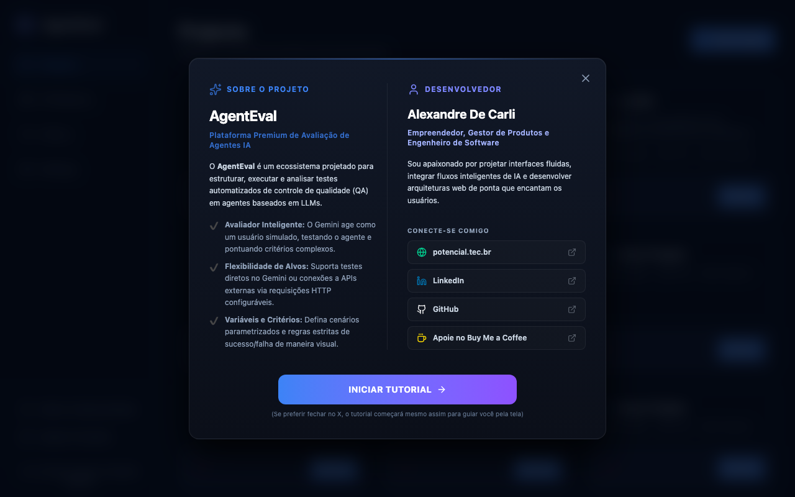
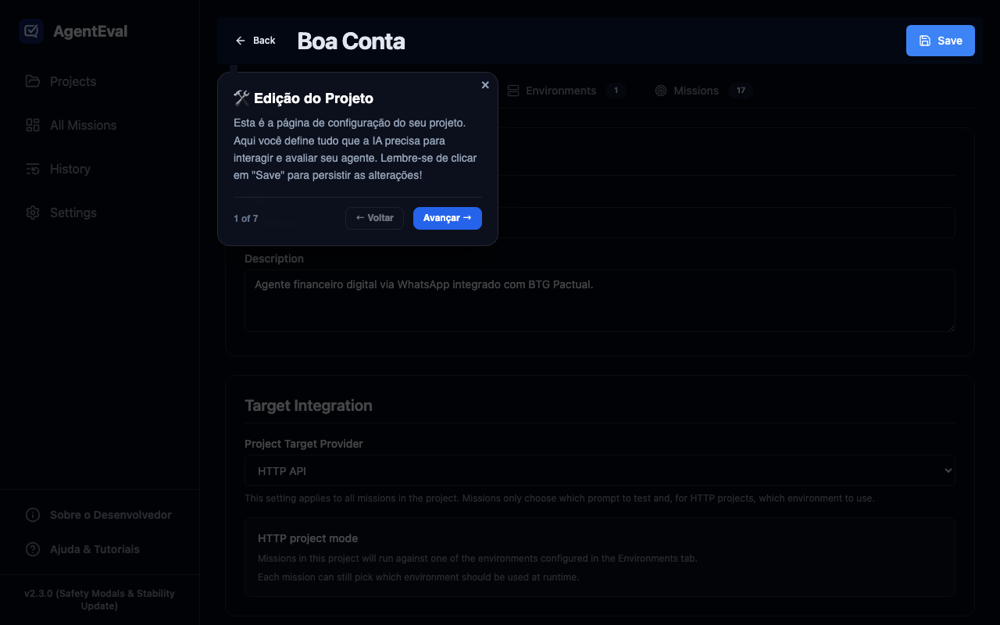
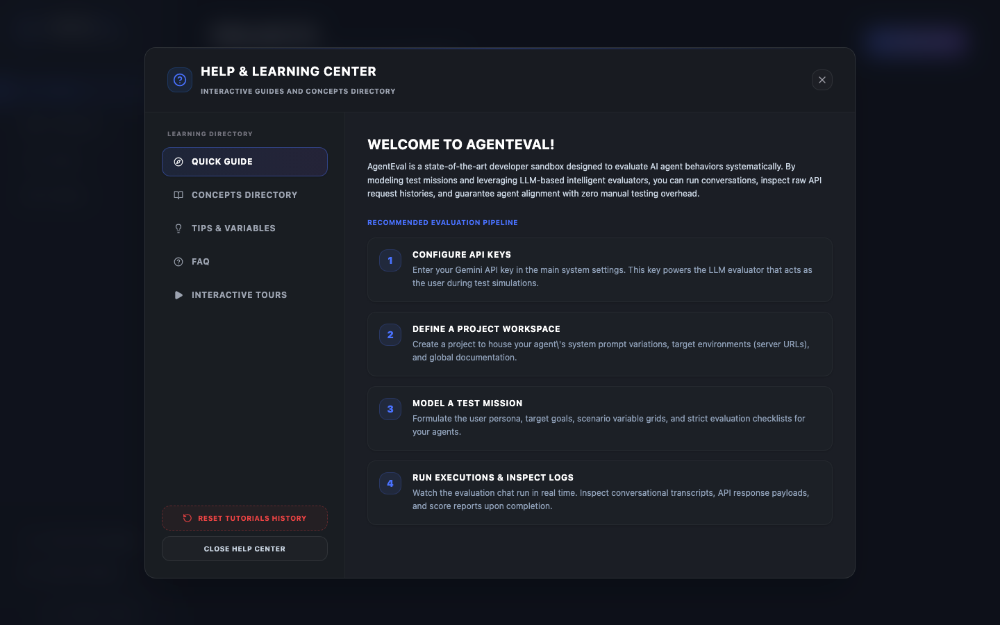
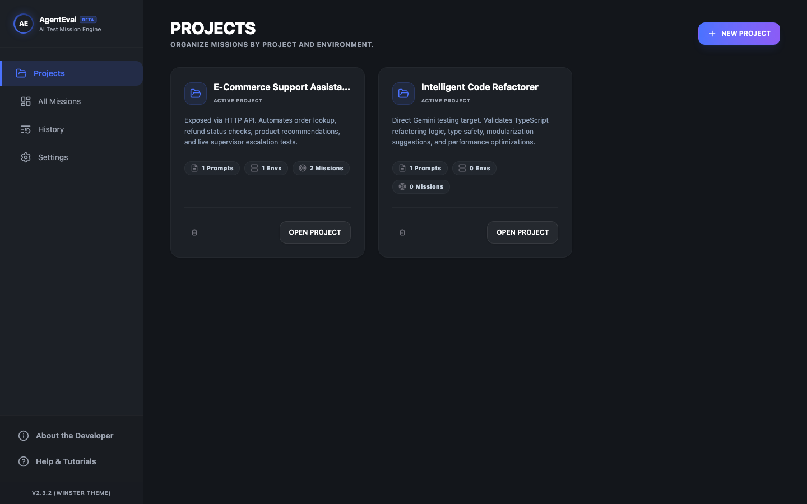
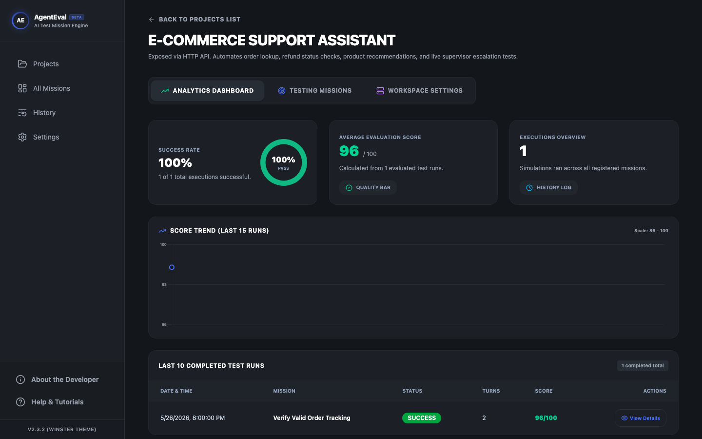
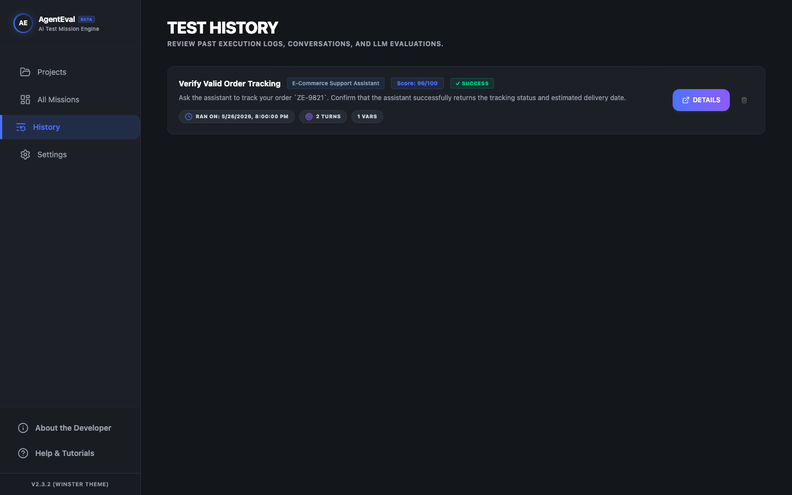
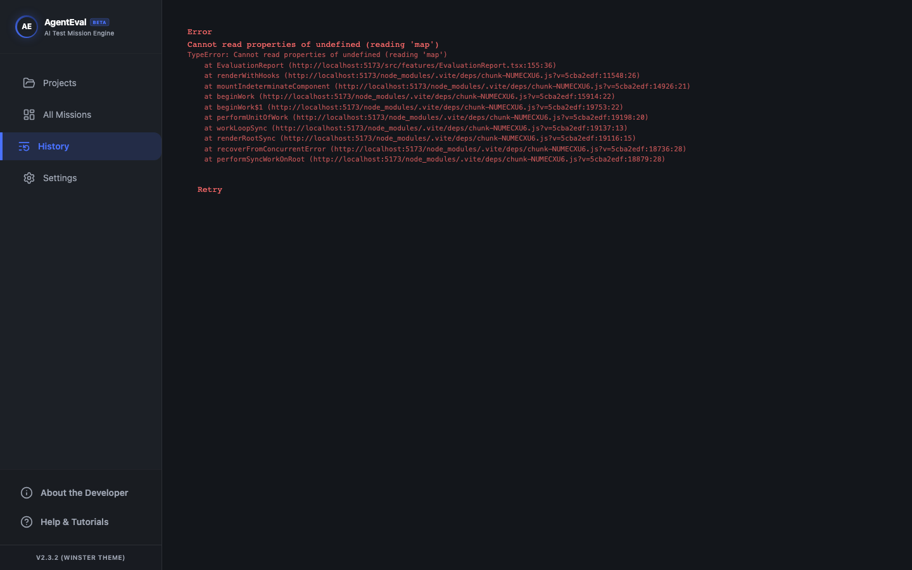

# AgentEval

An automated end-to-end testing and evaluation platform for **conversational systems exposed via HTTP API or tested directly on Gemini**.

> **What AgentEval tests:** Not an LLM in isolation — but your **complete system**: backend, API, business logic, and AI layer together. If your system has a chat API (POST to send, GET to poll), AgentEval can test it. If your target itself runs on Gemini, AgentEval can also execute it directly with the same project-level Gemini configuration.

## 🌐 Live Demo & Testing

🚀 Try the live premium web application online: **[https://agenteval-zitp.onrender.com/](https://agenteval-zitp.onrender.com/)**

---

## 📸 Screenshots & Premium Interface

### 🌟 Secure Onboarding & Developer Welcome
A multi-step onboarding wizard for first-time visitors that presents a personalized bio of the developer (Alexandre De Carli), presents a mandatory **Terms of Use** block detailing the non-collection of data (100% local operation), and walks the user through setting up their API key locally and securely.



### 🛠️ Interactive Project Editor & Guided Tour
A premium step-by-step interactive guided tour (powered by Driver.js) dynamically shows you how to edit projects, link system prompts, configure environments, generate test missions with AI, and run simulations.



### 💡 Quick Help & Concept Learning
A dynamic slide-out Help Panel is available on every screen, allowing you to instantly learn about key AgentEval concepts, read the developer bio, or trigger tours at any moment.



### 📂 Projects Dashboard
Organize your test suite by project. Each project holds documentation, system prompts, environments (dev/staging/prod), and missions.



### 🎯 Mission Board — AI Generation
Each project has a mission board. Click **Generate** to let Gemini analyze your project documentation and system prompts and produce a comprehensive test suite automatically.



### 📋 Test History & Logs
Every run is logged with status, number of turns, and AI evaluation score. You can view raw exchange data, timestamps, and LLM payloads.



### 📊 Evaluation Report & Actionable Suggestions
After each run, the Evaluator Agent produces a full report: overall score, per-criterion breakdown, response metrics, and targeted prompt improvement suggestions.



> 📁 More screenshots (chat log, prompt improvements) available in [`docs/`](docs/).

---

## 🚀 How It Works

AgentEval orchestrates a fully automated QA loop between three components:

```
┌─────────────────────────────────────────────────────────┐
│                       AgentEval                         │
│                                                         │
│  ┌──────────────┐                  ┌──────────────────┐ │
│  │ Tester Agent │  ── POST ──────► │  YOUR SYSTEM     │ │
│  │   (Gemini)   │  ◄── GET ─────── │  (Target API)    │ │
│  └──────────────┘                  └──────────────────┘ │
│         │                                               │
│         ▼  (after mission ends)                         │
│  ┌──────────────────┐                                   │
│  │ Evaluator Agent  │ ──► Score + Report + Prompt Fixes │
│  │   (Gemini)       │                                   │
│  └──────────────────┘                                   │
└─────────────────────────────────────────────────────────┘
```

1. **Tester Agent (Gemini)** acts as a simulated user with a specific persona and goal. It can send messages via HTTP `POST` and poll via HTTP `GET`, or interact with a Gemini target directly.
2. **Your System** is the target — any chatbot, AI assistant, backend with POST/GET endpoints, or a Gemini model configured directly in the project.
3. **Evaluator Agent (Gemini)** reviews the full conversation log, grades it against your criteria, and produces a detailed report with prompt improvement suggestions.

---

## 🎯 What Can Be Tested?

AgentEval is **system-agnostic**. Any backend that communicates through text over HTTP:

| System Type                    | How it connects                                    |
| ------------------------------ | -------------------------------------------------- |
| WhatsApp Bot (via webhook)     | POST to webhook, GET to chat history API           |
| Customer Support Chatbot       | POST to chat API, GET to poll conversation         |
| Internal AI Assistant          | POST to internal API, GET to fetch responses       |
| Gemini-based Agent             | Direct Gemini call using project target settings   |
| Voice Bot (text interface)     | POST transcription text, GET bot reply             |
| Any REST API with chat feature | Configure POST/GET freely per mission              |

---

## ✨ Core Features

### Projects & Environments
Organize test suites by project. Each project holds:
- **Documentation** (Markdown) — used by the AI to generate intelligent missions
- **System Prompts** — the actual prompts from your target system, referenced by missions
- **Target Integration** — choose once per project between `HTTP API` and `Gemini`
- **Environments** — separate configs for dev, staging, and production (URLs + auth only)

If the project target is set to **Gemini**, AgentEval reuses the same Gemini API key from **Settings** for the direct target call. If the project target is set to **HTTP API**, each mission chooses which environment to run against.

### AI Mission Generation
Point AgentEval at your project docs and system prompts. Click **Generate with AI** and Gemini 1.5 Pro analyzes your system and generates 8–15 structured test missions covering happy paths, edge cases, routing, error handling, and multi-turn flows.

### Mission Editor
- **Tester Personas** — define how the simulated user behaves
- **Variables & Randomization** — run the same mission with different inputs (`{{name}}`, `{{order_id}}`, etc.)
- **Evaluation Criteria** — custom grading rules per mission
- **System Prompt Linking** — link to a project system prompt instead of copy-pasting
- **Project-aware Targeting** — missions inherit whether the project runs against `HTTP API` or `Gemini`

### Real-time Test Runner
Watch the conversation happen live. Polling indicators, turn-by-turn messages, and debug logs for inspecting raw API responses.

### Automated Evaluation Reports
- Overall score (0–100)
- Per-criterion breakdown (0–10 each)
- Response time metrics (first response + full completion)
- Targeted prompt improvement suggestions with severity levels (`critical` / `important` / `suggestion`)

### Persistent File Storage & Hybrid Fallback
All data is stored in JSON files under `./data/` via our custom local server persistence layer. If running in a web sandbox (like our Render Live Demo), it seamlessly falls back to browser-synchronized `localStorage` to keep your workspace persistent across refreshes.

### 🔒 Secure AES-GCM Key Encryption
To provide the highest level of privacy and corporate safety, your **Gemini API Key** is encrypted physically on disk (inside your browser's persistent files or settings JSON) using standard AES-GCM (256-bit) local storage encryption via the native Web Crypto API. This guarantees that your key is never stored in plain text and cannot be read directly from persistent storage files. Decryption occurs transparently only in memory during runtime.

### 🛡️ Mandatory Consent & Terms of Use
Compliance-first design requires every user to review and explicitly accept our Terms of Use (detailing that the application is free, open-source, operates 100% locally, and does not transmit any user prompts or keys to external servers) upon their first launch. The initial screen completely hides close buttons, making it a robust, secure gatekeeper.

### 🤖 Interactive Visual Guides (Driver.js)
No complex documentation reading required! AgentEval features two fully automated interactive guided tours (general dashboard tour and project editor tour) that step through the interface, highlight selectors, and click tabs programmatically to teach concepts dynamically.

### ⚠️ Destructive Confirmation Dialogues
Avoid any accidental losses of projects or valuable mission configs! All deletion actions are now protected by premium, glassmorphic popover scale-bounce styled confirmation modal windows, asking for direct verification before carrying out any deletes.

### 🔔 Real-time Toast Notifications
A custom-designed, non-blocking Toast notification system replaces raw browser `alert()` popups with themed success, warning, and error messages that slide in gracefully and match the dark control room aesthetics.

### ⚡ Power-User Accelerators
Save your workspace settings and mission parameters instantly using `Cmd+S` or `Ctrl+S` keyboard shortcuts, and close any modal dialogue or popup windows effortlessly using the `Escape` key.

---

## 🛠️ Target System Requirements

AgentEval supports two target modes:

### Mode 1 — HTTP API

Your system needs two HTTP endpoints:

### POST — Send Message

AgentEval sends user messages here. Configure a **Payload Template** using `{{message}}` as the placeholder.

```
POST https://your-system.com/api/chat
Authorization: Bearer your-token
Content-Type: application/json

{ "userId": "tester", "text": "{{message}}" }
```

**Expected:** any `2xx` response. Body is ignored.

### GET — Poll Response

AgentEval polls this endpoint until a new response appears.

```
GET https://your-system.com/api/chat/history/tester
Authorization: Bearer your-token
```

**Expected response formats:**

```jsonc
// Root-level array
[{ "id": 1, "role": "model", "content": "Hi! How can I help?" }]

// Or nested
{ "data": { "messages": [{ "id": 1, "role": "model", "content": "..." }] } }
```

AgentEval also understands Gemini-style structured output:
```jsonc
{ "parts": [{ "text": "..." }] }
{ "userResponse": "...", "functionToExecute": "..." }
```

### Mode 2 — Direct Gemini

If your target itself is a Gemini agent, configure the project target as `Gemini` and pick the model to test. AgentEval will:

- Reuse the global Gemini API key from **Settings**
- Send the selected mission prompt as the Gemini `systemInstruction`
- Run the conversation directly against the chosen Gemini model without requiring POST/GET endpoints

---

## ⚙️ Setup

### 1. Install & run

```bash
npm install
npm run dev
```

### 2. Add Gemini API Key

Go to **Settings** and enter your [Google AI Studio](https://aistudio.google.com/apikey) API key. Stored in `./data/agent-qa-settings.json` on your machine — never sent anywhere except the Gemini API.

### 3. Create a Project

Click **New Project**, add your documentation and system prompts, choose the project target mode, then:

- For **HTTP API** projects: configure one or more environments (URLs + auth)
- For **Gemini** projects: choose the Gemini model to test directly

Then click **Generate with AI** to create your first missions.

---

## 🧪 E2E System Testing

AgentEval features a complete suite of automated End-to-End (E2E) integration tests using **Playwright** to validate all key user flows (onboarding setup, security encryption, project configurations, guided tours, and tab navigations).

### Running All System Tests
We provide a unified test orchestrator that sequentially runs the E2E test scripts, manages the Vite development server lifecycle, and outputs a complete CLI dashboard:
```bash
node scratch/test-all.cjs
```
*Note: The orchestrator dynamically probes port `5173`. It will automatically reuse any active dev server session, or spin up and tear down a new instance dynamically if the port is closed.*

### Running Tests Individually
For local debugging during developmental modifications, you can also execute any test suite individually:
- **Welcome Modal & Encryption**: `node scratch/test-welcome-modal.cjs`
- **Tour Pause & Onboarding Resume**: `node scratch/test-onboarding-resume.cjs`
- **Interactive Project Tour**: `node scratch/test-project-tour.cjs`
- **Tab & Sidebar Navigation**: `node scratch/test-navigation.cjs`
- **UI Element States**: `node scratch/test-ui.cjs`

---

## 🧰 Tech Stack

| Layer       | Technology                                        |
| ----------- | ------------------------------------------------- |
| Framework   | React 18 + TypeScript                             |
| Bundler     | Vite                                              |
| Styling     | Tailwind CSS v4                                   |
| State       | Zustand + file-based persistence (`./data/*.json`)|
| AI          | Google Gemini API (generation + evaluation)       |
| Icons       | Lucide React                                      |
