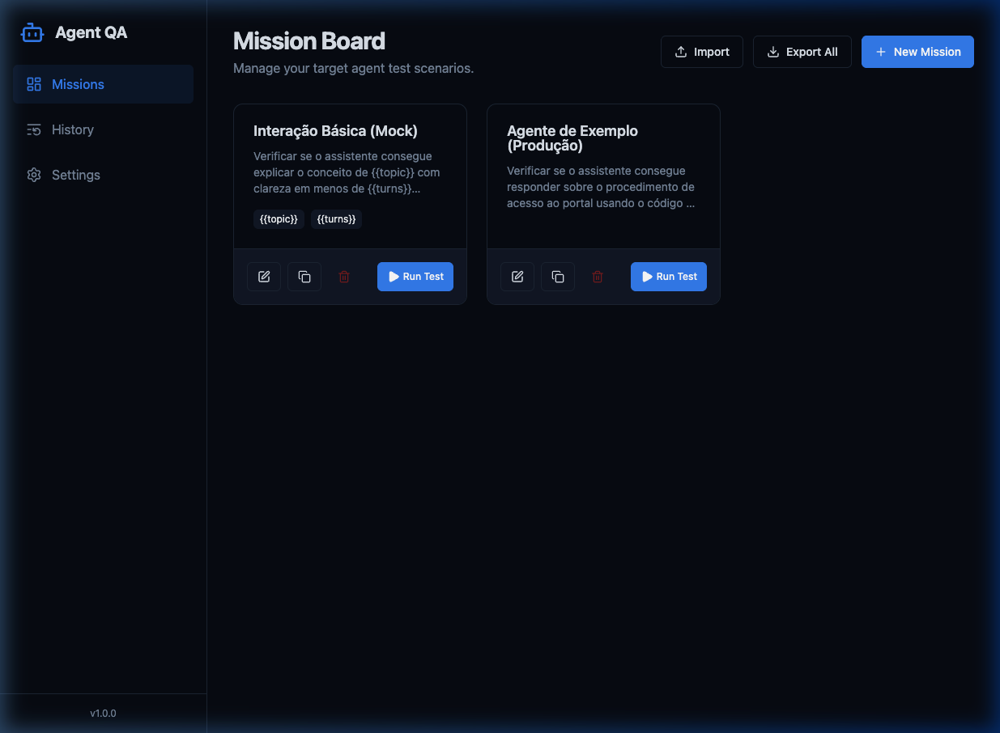
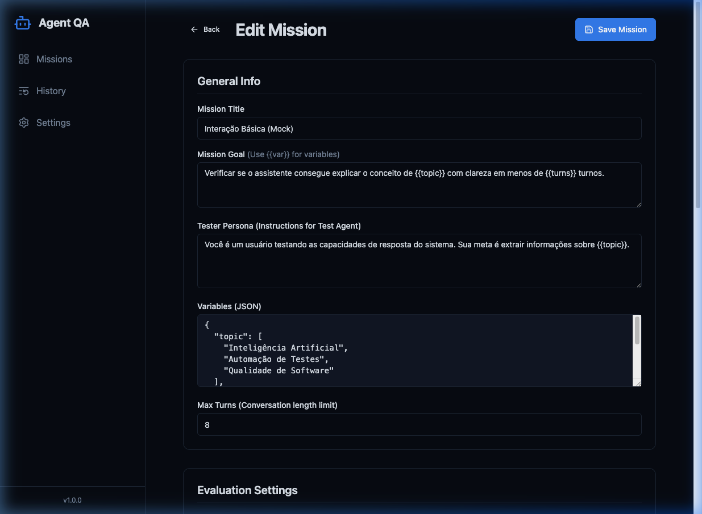
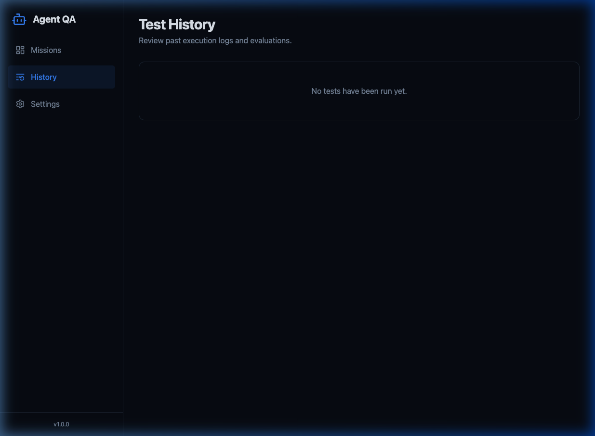
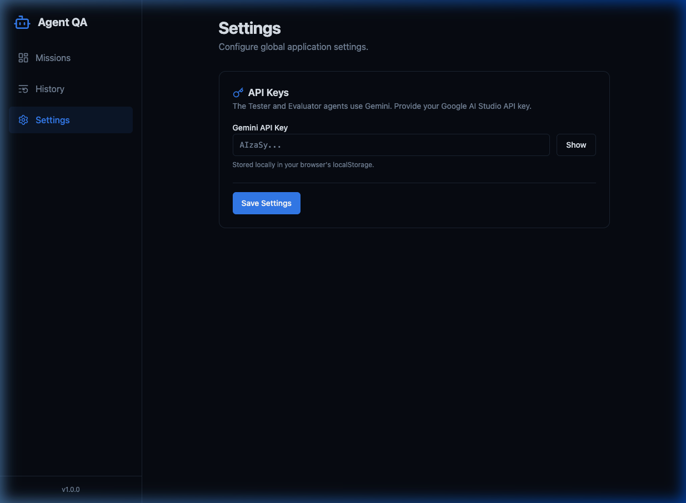

# AgentEval

An automated end-to-end testing and evaluation platform for **any system that exposes a conversational HTTP API**.

> **Important:** AgentEval does **not** test an LLM (Large Language Model) directly. It tests a **complete system** — your backend, your API, your business logic, and the AI layer together — by communicating with it through standard HTTP endpoints (`POST` to send messages, `GET` to poll responses). If your system has a chat API, AgentEval can test it.

## 📸 Screenshots

| Mission Board | Mission Editor |
|---|---|
|  |  |

| Test History | Settings |
|---|---|
|  |  |

---

## 🚀 How it Works

AgentEval orchestrates a fully automated QA loop between three components:

```
┌─────────────────────────────────────────────────────────┐
│                      AgentEval                          │
│                                                         │
│  ┌──────────────┐                  ┌──────────────────┐ │
│  │ Tester Agent │  ── POST ──────► │  YOUR SYSTEM     │ │
│  │   (Gemini)   │  ◄── GET ─────── │  (Target API)    │ │
│  └──────────────┘                  └──────────────────┘ │
│         │                                               │
│         ▼  (after mission ends)                         │
│  ┌──────────────────┐                                   │
│  │ Evaluator Agent   │                                  │
│  │   (Gemini)        │ ──► Score + Report + Prompt Fixes│
│  └──────────────────┘                                   │
└─────────────────────────────────────────────────────────┘
```

1.  **Tester Agent (Gemini)**: Acts as a simulated user with a specific persona and goal. It sends messages to your system via HTTP `POST` and reads responses via HTTP `GET`.
2.  **Your System (Target)**: The system under test. It can be anything — a chatbot, a customer support platform, an AI assistant, a voice bot backend — as long as it exposes POST/GET HTTP endpoints for sending and receiving messages.
3.  **Evaluator Agent (Gemini)**: After the conversation ends, it reviews the full chat log, grades the interaction against your custom criteria, and generates a detailed report with scores and actionable prompt improvement suggestions.

---

## 🎯 What Can Be Tested?

AgentEval is **system-agnostic**. It can test any backend that communicates through text via HTTP. Examples:

| System Type                     | How it connects                                      |
| ------------------------------- | ---------------------------------------------------- |
| WhatsApp Bot (via webhook)      | POST to your webhook, GET to your chat history API   |
| Customer Support Chatbot        | POST to your chat API, GET to poll conversation      |
| Internal AI Assistant           | POST to your internal API, GET to fetch responses    |
| Voice Bot (text interface)      | POST transcription text, GET bot reply               |
| Any REST API with chat feature  | Configure POST/GET freely in the Mission Editor      |

---

## ✨ Core Features

-   **Mission Board**: Create, clone, import/export test scenarios ("Missions").
-   **Advanced Mission Editor**:
    -   **Tester Personas**: Define how the simulated user should behave.
    -   **Evaluation Criteria**: Set custom grading rules (e.g., "Tone", "Accuracy", "Safety").
    -   **Variables & Permutations**: Run the same mission with randomized inputs (e.g., different names, IDs, or topics).
    -   **Target System Prompt**: Paste the original system prompt to enable the evaluator to suggest improvements.
-   **Real-time Test Runner**: Watch the conversation happen live with polling indicators.
-   **Automated Evaluation Reports**:
    -   Overall score (0–100)
    -   Per-criterion breakdown (0–10 each)
    -   Response time metrics
    -   Targeted prompt fix suggestions with severity levels
-   **Test History**: Keep a record of every test run for regression analysis.

---

## 🛠️ Target System Requirements

Your system **must** expose two HTTP endpoints. AgentEval connects to them using the configuration you provide in the Mission Editor.

### Endpoint 1: Send Message — `POST`

AgentEval sends user messages to this endpoint. You configure the **Payload Template** (a JSON string) in the Mission Editor. Use `{{message}}` as a placeholder for the tester's message.

**Example Configuration:**
| Field              | Example Value                                  |
| ------------------ | ---------------------------------------------- |
| POST URL           | `https://your-system.com/api/chat`             |
| Authorization      | `Bearer your-api-token`                        |
| Payload Template   | `{"userId": "test-user", "text": "{{message}}"}` |

**What AgentEval does:**
```
POST https://your-system.com/api/chat
Authorization: Bearer your-api-token
Content-Type: application/json

{
  "userId": "test-user",
  "text": "Olá, preciso de ajuda"
}
```

**Expected:** Any `2xx` status code. The response body is ignored.

---

### Endpoint 2: Poll Responses — `GET`

Since your system may process messages asynchronously (e.g., AI inference, function calls), AgentEval **polls** this endpoint at a configurable interval until a new response appears or a timeout is reached.

**Example Configuration:**
| Field              | Example Value                                      |
| ------------------ | -------------------------------------------------- |
| GET URL            | `https://your-system.com/api/chat/history/test-user` |
| Polling Interval   | `3000` ms                                          |
| Max Timeout        | `45` seconds                                       |
| Response Path      | `data.messages`                                    |

**Expected Response Format:**

Your GET endpoint should return a JSON object or array containing the conversation messages. AgentEval understands the following structures:

```jsonc
// Option A: Root-level array
[
  { "id": 1, "role": "user", "content": "Hello" },
  { "id": 2, "role": "model", "content": "Hi! How can I help?" }
]

// Option B: Nested under "messages" or "data"
{
  "data": {
    "messages": [
      { "id": 1, "role": "user", "content": "Hello" },
      { "id": 2, "role": "model", "content": "Hi! How can I help?" }
    ]
  }
}
```

**Message Schema:**

| Field           | Required | Description                                                                 |
| --------------- | -------- | --------------------------------------------------------------------------- |
| `id`            | Recommended | Unique identifier. Used to detect new messages vs. old ones.             |
| `role`          | **Yes**  | Must be `"model"` or `"target"` for your system's replies.                  |
| `content`       | **Yes**  | The text content of the message (string).                                   |
| `contentStatus` | Optional | If set to `"processing"` on a `user` message, AgentEval will keep polling.  |

**Advanced: Structured Content**

AgentEval can also extract text from more complex response formats:
-   **Gemini-style**: `{"parts": [{"text": "Hello"}]}`
-   **Structured output**: `{"userResponse": "Hello", "functionResult": {...}}`

---

## ⚙️ Configuration

1.  **Gemini API Key**: Go to **Settings** and provide your [Google AI Studio](https://aistudio.google.com/apikey) API Key. It is stored **only in your browser's `localStorage`** and never sent to any server other than the Gemini API.
2.  **Mission Setup**: In the Mission Editor, configure your target system's POST/GET URLs, authentication headers, payload template, and response path.

---

## 🚀 Getting Started

1.  **Install dependencies**:
    ```bash
    npm install
    ```
2.  **Start the development server**:
    ```bash
    npm run dev
    ```
3.  **Try immediately**: The system comes pre-loaded with a **Mock** mission that simulates a target API locally. Click **Run Test** to see AgentEval in action without any external setup.

---

## 🧰 Tech Stack

| Layer     | Technology                          |
| --------- | ----------------------------------- |
| Framework | React 18 + TypeScript               |
| Bundler   | Vite                                |
| Styling   | Tailwind CSS v4                     |
| State     | Zustand (persisted in localStorage) |
| AI        | Google Gemini API                   |
| Icons     | Lucide React                        |
